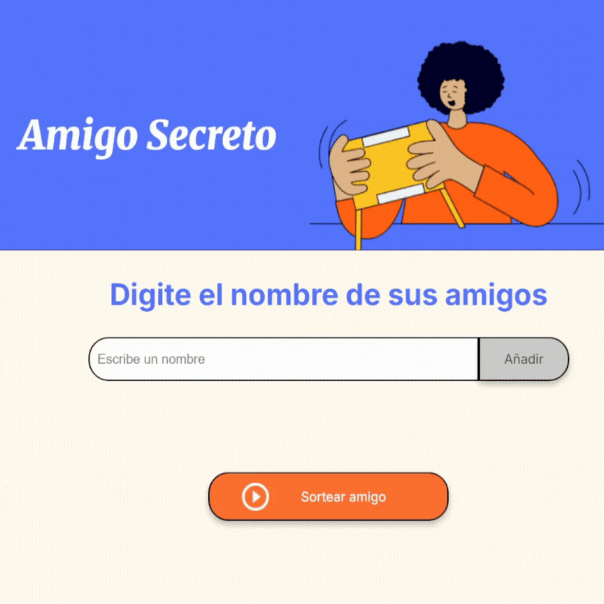

# Amigo Secreto

<h4>Challenge de Amigo secreto </h4> 

El Desafío Amigo Secreto es un paso importante para el éxito en el programa ONE. A través de la práctica y el perfeccionamiento de la lógica de programación, el obtivo es  consolidar conocimientos, dominar el pensamiento lógico, mejorar las habilidades de análisis y resolución de problemas, y ampliar la perspectiva en el mundo del desarrollo.

<h4>Funcionamiento</h4>
El funcionamiento de la aplicación es intuitiva ante el usuario.

* Primeramente se tiene un cuadrado para ingresar los nombres de los amigos que queremos sortear.

* Posterior a esto podemos seleccionar el botón de color gris con el texto "Añadir", este lo que hará es agregar el nombre a la lista de amigos.
    * Si no se encuentra un nombre en la caja y seleccionamos el boton "Añadir", automáticamente el programa nos mostrará la leyenda en color rojo "Ingresa un nombre válido", esto quiere decir que no se encuentra un nombre en la caja.

* Una vez teniendo la lista de amigos creada, se procede a hacer el sorteo, para esto utilizamos el botón de color naranja con el texto "Sortear Amigo". Este botón tiene la función de escoger un nombre al azar de la lista de amigos, teniendo como resultado, una leyenda de color verde en pantalla mostrando El amigo secreto sorteado es: nombre.
    * En dado caso que la lista solo contenga un amigo y queramos iniciar el sorteo, en pantalla se mostrará la leyenda en color rojo "Se necesitan al menos 2 amigos para sortear", refiriendo a que se necesitan al menos 2 personas en la lista para iniciar el sorteo.
    * Si solo queda una sola persona por sortear, en pantalla se mostrará la leyenda en color verde "El ultimo amigo secreto sorteado es: nombre"
    * Se hace referencia a `nombre` como sustitución y fines de ejemplo a un nombre de un amigo sorteado de la lista creada, ejemplo: `El amigo secreto sorteado es: Maria.` o `El último amigo secreto sorteado es: Maria.`
* Una vez sorteado todos los amigos podemos reiniciar la aplicación recargando la página, esto nos dejará crear una lista nueva y un sorteo nuevo.

<h4>Mejoras durante el desarrollo</h4>
Par el desarrollo de la aplicación una plantilla fue proporcionada por el programa. Como mejora a la misma, he agregado unas etiquetas nuevas y estilos para una mejor visualización.

*  Etiqueta de Error:
    * La siguiente etiqueta fue agregada como sustitución al alert que se sugería en la demostración. Esta nos ayuda a mostar en pantalla los errores que vayan apareciendo durante la ejecución.
    `<ul id="error" class="error-list"></ul>`
    * Estilos:
    `.error-list {
    margin-top: 15px;
    color: red;
    font-size: 22px;
    font-weight: bold;
    text-align: center;
    }`

<h4>Comentarios y mejoras al proyecto</h4>

Me ha gustado bastante el desarrollo completo de la aplicación, sin duda me ha ayudado en varios aspecto en mi lógica de programación, desde el uso de funciones, listas y manejo del DOM.
Como mejoras posteriores a agregar se considera un botón que reinicie la aplicación, esto con el fin de que el usuario tenga una mejor interacción con la página, esto evitando la recarga de la aplicación sin salirnos de la interacción misma.

<h4>Conclusiones</h4>
Agradezco primeramente a todo el equipo de Alura Latam y al programa de ONE en la creación de los cursos necesarios para realización de este challenge de Amigo Secreto. Me ha ayudado a fortalecer mis conocimientos en el lenguaje de programación JavaScript y en la mejora de mi lógica de programacíón. Seguimos creciendo y aprendiendo, agradezco cualquier comentario y sugerencia, me ayudaría mucho a seguirme formando como desarrollador.

<h4>Tecnologías utilizadas</h4>

- JavaScript
- Html
- Css